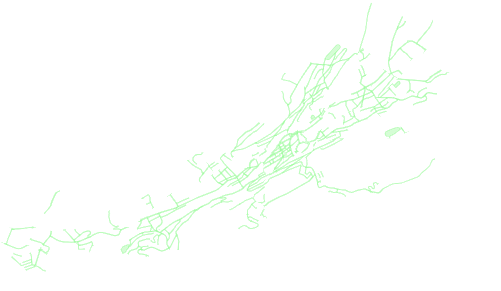

### team_laga

# Identifizierung von Entsieglungspotenzial

## Table of Content
1. Project Description
2. Technologies used
3. Installation
4. Authors

## 1. Project Description
This project focuses on evaluating the potential areas of roads and parking lots which could be used as green areas.
This would lead to an improved air quality, cooler temperatures in the summer and also increased life quality.
- Additional information can be found in the [presentation](ODH_2022_OST_LAGA_PRES.pdf) where the city of St. Gallen is analysed as an example.



## 2. Technologies used
In this project we used the information of the roads and the zones from the Kanton [St. Gallen](https://daten.sg.ch/) and displayed
them using the matplotlib- and osmnx library in Python. The project consists of different tools to prepare the available dataset, characterize streetdata, calculate and plot different unsealing configuration. 

    
### The main modules are:
    
-**tools_polygon** (Plot and create Polygons from Geodata, Intersect and Filter)
        
-**tools_osmnx** (easier plotting and visualization)
        
-**tools_street** (Characterize streetdata and propose randomised unsealing solutions)
        
    
### Sources Datasets: 
[begegnungszonen.csv](https://daten.sg.ch/explore/dataset/begegnungszonen%40stadt-stgallen/export/?disjunctive.gebiet&dataChart=eyJxdWVyaWVzIjpbeyJjaGFydHMiOlt7InR5cGUiOiJjb2x1bW4iLCJmdW5jIjoiQ09VTlQiLCJzY2llbnRpZmljRGlzcGxheSI6dHJ1ZSwiY29sb3IiOiIjZmYwMDAwIn1dLCJ4QXhpcyI6InJlYWxpc2llcnQiLCJtYXhwb2ludHMiOiIiLCJ0aW1lc2NhbGUiOiJ5ZWFyIiwic29ydCI6IiIsImNvbmZpZyI6eyJkYXRhc2V0IjoiYmVnZWdudW5nc3pvbmVuQHN0YWR0LXN0Z2FsbGVuIiwib3B0aW9ucyI6eyJkaXNqdW5jdGl2ZS5nZWJpZXQiOnRydWV9fX1dLCJkaXNwbGF5TGVnZW5kIjp0cnVlLCJhbGlnbk1vbnRoIjp0cnVlfQ%3D%3D), 
[gemeindestrassenplan.csv](https://daten.sg.ch/explore/dataset/gemeindestrassenplan%40stadt-stgallen/export/?disjunctive.strassenkl&disjunctive.strassenna&disjunctive.strassennr), 
[tempo-30-zonen.csv](https://daten.sg.ch/explore/dataset/tempo-30-zonen%40stadt-stgallen/export/)

## 3. Installation

```
git clone https://github.com/parisj/team_laga.git
cd team_laga
pip install -r requirements.txt
```
    
    
## 4.Authors
  - Anton Paris
  - Alexander Bruun
  - Pierluigi Margarito
  - Leart Sejdiu
    
    
